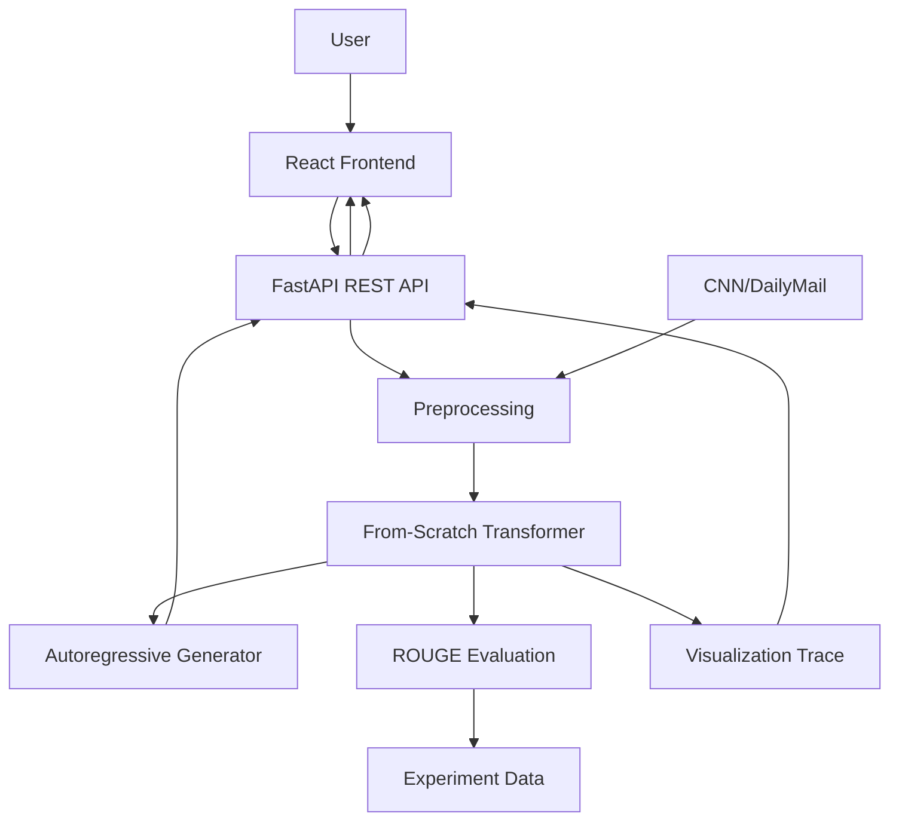

# AttenSum — Complete Project Documentation

**Project:** AttenSum — From-Scratch Text Summarizer  
**Project Type:** Full-Stack AI / NLP / Deep Learning Research & Learning Platform  
**Domain:** GenAI / Deep Learning / NLP Research / Media  
**Primary Audience:** ML Engineers, NLP Students, Researchers, Analysts, Media & Content Professionals  
**Status:** Day 1 — Documentation / Planning Phase  
**Implementation Status:** No production implementation has started yet  
**Primary Stack:** Python · PyTorch · FastAPI · React · NLTK · rouge-score · Tailwind CSS · Axios  
**Core Dataset:** CNN/DailyMail Summarization Dataset  
**Core Model:** Small Transformer Encoder–Decoder implemented completely from scratch  

---

# Table of Contents

1. [Project Overview](#1-project-overview)
2. [Project Identity and Scope](#2-project-identity-and-scope)
3. [Problem Definition](#3-problem-definition)
4. [Product Vision and Value Proposition](#4-product-vision-and-value-proposition)
5. [Target Users and Personas](#5-target-users-and-personas)
6. [Jobs To Be Done](#6-jobs-to-be-done)
7. [Business Requirements](#7-business-requirements)
8. [Product Requirements](#8-product-requirements)
9. [Product Features](#9-product-features)
10. [User Journeys and User Flows](#10-user-journeys-and-user-flows)
11. [UX and UI Requirements](#11-ux-and-ui-requirements)
12. [Functional Requirements](#12-functional-requirements)
13. [Non-Functional Requirements](#13-non-functional-requirements)
14. [Technical Architecture](#14-technical-architecture)
15. [High-Level Design](#15-high-level-design)
16. [Transformer Model Architecture](#16-transformer-model-architecture)
17. [Dataset and Data Pipeline](#17-dataset-and-data-pipeline)
18. [Training Architecture](#18-training-architecture)
19. [Inference and Autoregressive Generation](#19-inference-and-autoregressive-generation)
20. [Evaluation Strategy](#20-evaluation-strategy)
21. [Experimentation and Experiment Comparison](#21-experimentation-and-experiment-comparison)
22. [Interactive Transformer Execution Visualization](#22-interactive-transformer-execution-visualization)
23. [Attention Visualization](#23-attention-visualization)
24. [FastAPI Backend Design](#24-fastapi-backend-design)
25. [React Frontend Design](#25-react-frontend-design)
26. [Data and Persistence Design](#26-data-and-persistence-design)
27. [API Specification](#27-api-specification)
28. [Low-Level Design](#28-low-level-design)
29. [Authentication and Session Handling](#29-authentication-and-session-handling)
30. [Security Design](#30-security-design)
31. [Error Handling and Reliability](#31-error-handling-and-reliability)
32. [Testing Strategy](#32-testing-strategy)
33. [Documentation and Reproducibility](#33-documentation-and-reproducibility)
34. [Deployment Architecture](#34-deployment-architecture)
35. [CI/CD and Engineering Workflow](#35-cicd-and-engineering-workflow)
36. [Observability and Monitoring](#36-observability-and-monitoring)
37. [Performance and Scalability](#37-performance-and-scalability)
38. [Risks and Mitigations](#38-risks-and-mitigations)
39. [Product Differentiation](#39-product-differentiation)
40. [MVP Definition](#40-mvp-definition)
41. [Development Roadmap](#41-development-roadmap)
42. [Future Scope](#42-future-scope)
43. [Requirements Traceability Matrix](#43-requirements-traceability-matrix)
44. [Architecture Decision Records](#44-architecture-decision-records)
45. [Repository Structure](#45-repository-structure)
46. [Definition of Done](#46-definition-of-done)
47. [Project Success Metrics](#47-project-success-metrics)
48. [Viva and Project Defense Preparation](#48-viva-and-project-defense-preparation)
49. [Open Decisions and TBD Items](#49-open-decisions-and-tbd-items)
50. [Final Project Definition](#50-final-project-definition)

---

# 1. Project Overview

## 1.1 What is AttenSum?

AttenSum is a full-stack AI-powered text summarization and Transformer learning platform.

The system is designed around a small **Transformer encoder-decoder implemented completely from scratch** using PyTorch. The model will be trained for abstractive summarization using the CNN/DailyMail summarization dataset.

Unlike a conventional summarization website that hides the underlying model behind an API, AttenSum has a second purpose: it makes the Transformer understandable and inspectable.

The final product combines:

- Practical abstractive text summarization.
- A from-scratch Transformer implementation.
- ROUGE-based model evaluation.
- Model experiment comparison.
- Transformer architecture education.
- Attention inspection.
- Interactive internal Transformer execution visualization.
- Token-by-token autoregressive generation inspection.
- A React frontend.
- A FastAPI backend.
- Automated testing.
- Reproducible training and evaluation documentation.
- Basic authentication/session handling.

## 1.2 Project Status

This documentation is being created at the beginning of the project.

**Current status:**

- Product requirements: Approved.
- Technical implementation: Not started.
- Transformer implementation: Not started.
- Dataset preprocessing: Not started.
- Training: Not started.
- Backend: Not started.
- Frontend: Not started.
- Visualization: Not started.
- Evaluation: Not started.
- Testing: Not started.
- Deployment: Not started.

Therefore, this document intentionally separates **approved requirements and proposed designs** from **implemented functionality**.

Any implementation-specific detail that is not defined by the approved PRD is marked **TBD** rather than being presented as an existing capability.

## 1.3 Documentation Principle

The approved AttenSum PRD is the primary source of truth for product requirements.

This document converts those requirements into a complete engineering and product documentation structure. Where the PRD does not define an implementation detail, the decision remains **TBD** until the implementation is designed and built.

---

# 2. Project Identity and Scope

## 2.1 Project Name

**AttenSum — From-Scratch Text Summarizer**

## 2.2 Product Category

Media / NLP Research.

## 2.3 Technical Domain

- Generative AI
- Natural Language Processing
- Deep Learning
- Transformer Architectures
- Text Summarization
- Machine Learning Research
- Full-Stack Application Development

## 2.4 Core Technical Stack

| Area | Technology |
|---|---|
| Programming Language | Python |
| Deep Learning | PyTorch |
| Backend | FastAPI |
| API | REST |
| Frontend | React |
| Styling | Tailwind CSS |
| HTTP Client | Axios |
| NLP | NLTK |
| Evaluation | rouge-score |
| Dataset | CNN/DailyMail |
| Database | TBD |
| Authentication | TBD |
| Deployment | TBD |
| Testing Framework | TBD |
| Visualization Library | TBD |

## 2.5 Scope

The project covers the complete journey from source text to generated abstractive summary:

```text
User Text
   ↓
Input Validation
   ↓
Tokenization / Preprocessing
   ↓
From-Scratch Transformer
   ↓
Autoregressive Generation
   ↓
Generated Summary
   ↓
Frontend Presentation
   ↓
ROUGE Evaluation / Experiment Analysis
```

The learning layer expands this workflow:

```text
Input
 ↓
Tokenization
 ↓
Embeddings
 ↓
Positional Encoding
 ↓
Encoder
 ↓
Self-Attention
 ↓
Transformer Blocks
 ↓
Decoder
 ↓
Masked Self-Attention
 ↓
Encoder-Decoder Attention
 ↓
Output Projection
 ↓
Autoregressive Generation
 ↓
Summary
```

---

# 3. Problem Definition

## 3.1 User Problem

People who work with large amounts of written information often need to understand an article without reading every sentence immediately.

This affects:

- Researchers reviewing literature.
- Analysts scanning industry or news content.
- Media and content professionals reviewing articles.
- Students studying large amounts of written material.
- NLP/ML engineers experimenting with summarization systems.

The immediate problem is the time required to extract the central meaning of long-form text.

## 3.2 Technical Learning Problem

A second problem is specific to ML and NLP learners.

Transformer concepts such as:

- self-attention,
- positional encoding,
- encoder-decoder architecture,
- masking,
- multi-head attention,
- cross-attention, and
- autoregressive generation

can be understood theoretically but remain difficult to connect to an actual working implementation.

Pretrained summarization APIs can produce strong outputs while hiding the architecture and internal computations.

AttenSum therefore treats the Transformer as something that should be **inspectable and understandable**, not merely usable.

## 3.3 Combined Problem Statement

AttenSum addresses two connected problems:

1. **Information overload:** users need a concise representation of long-form text.
2. **Transformer opacity:** learners and practitioners need a way to connect Transformer theory with an actual from-scratch implementation.

---

# 4. Product Vision and Value Proposition

## 4.1 Vision

> Make long-form information faster to understand while making Transformer-based summarization easier to learn, inspect, experiment with, and evaluate.

The product should feel like a useful summarization application first and an educational/research platform second.

## 4.2 One-Line Value Proposition

> **AttenSum turns long text into concise abstractive summaries while giving NLP practitioners and ML students a transparent environment to understand, visualize, experiment with, and evaluate a Transformer built completely from scratch.**

## 4.3 Product Principle

The central product principle is:

> **Do not just show that a Transformer can summarize text. Show the student how that Transformer actually works.**

## 4.4 Product Experience Model

AttenSum can be understood as four connected product areas:

```text
                    ATTENSUM
                       │
        ┌──────────────┼──────────────┐
        │              │              │
    SUMMARIZE       EXPLORE       EVALUATE
        │              │              │
    Text Input      Transformer      ROUGE
    Summary         Architecture    Experiments
    Comparison      Attention       Charts
    Length          Internal Trace  Metrics
    Copy/Export     Generation
        │              │              │
        └──────────────┼──────────────┘
                       │
                  LEARN + BUILD
```

---

# 5. Target Users and Personas

## 5.1 Primary Persona — NLP/ML Student or Engineer

### Profile

A student, developer, engineer, researcher, or practitioner learning how Transformer-based summarization works.

### Problems

- Transformer implementations can feel like black boxes.
- Theory is difficult to connect with code.
- Pretrained APIs hide architectural details.
- Attention relationships are difficult to understand without visualization.
- Autoregressive generation is difficult to understand without observing it.
- Experiment comparison is inconvenient without dedicated tooling.
- Evaluation often requires separate tools.

### AttenSum Value

The user can interact with a working summarization system while studying the actual Transformer behind the generated output.

---

## 5.2 Secondary Persona — Researcher / Analyst

### Profile

A user who needs to process or screen large amounts of textual information.

### Problems

- Reading every article takes time.
- Important information may be buried inside long documents.
- Manual summarization is repetitive.
- Comparing model outputs manually is inefficient.

### AttenSum Value

The user gets a fast first-pass summary and can use evaluation information to study model behavior.

---

## 5.3 Secondary Persona — Media / Content Professional

### Profile

A professional who reviews or processes many articles.

### Problems

- Large volumes of articles require screening.
- Initial understanding takes time.
- Manual summarization does not scale efficiently.

### AttenSum Value

The generated summary helps the user decide which articles deserve deeper reading.

---

# 6. Jobs To Be Done

| ID | Job | User Need |
|---|---|---|
| JTBD-01 | Understand an article quickly | Get the main ideas without reading the entire article immediately |
| JTBD-02 | Identify relevant content | Quickly decide which articles deserve deeper reading |
| JTBD-03 | Learn Transformer summarization | Connect Transformer theory with a real implementation |
| JTBD-04 | Evaluate model changes | Measure whether architecture/training changes improve quality |
| JTBD-05 | Understand internal execution | Observe how input moves through the Transformer |
| JTBD-06 | Inspect attention and generation | Understand token relationships and token-by-token generation |

---

# 7. Business Requirements

## 7.1 Business Objective

Build a useful summarization product that also functions as a transparent research and learning environment for Transformer-based NLP.

## 7.2 Business Requirements

| ID | Requirement | Priority |
|---|---|---|
| BR-01 | Users must be able to provide supported text | Must |
| BR-02 | Users must receive an abstractive summary | Must |
| BR-03 | The summary must be generated by the from-scratch Transformer | Must |
| BR-04 | Users must be able to compare source and generated text | Must |
| BR-05 | The system must support ROUGE-1/2/L evaluation | Must |
| BR-06 | The application must use React and FastAPI | Must |
| BR-07 | The Transformer must be implemented from scratch | Must |
| BR-08 | The application must provide architecture information | Must |
| BR-09 | The project must include testing | Must |
| BR-10 | The project must include setup and reproduction documentation | Must |
| BR-11 | Basic authentication/session handling must be supported | Required full-stack expectation |
| BR-12 | Users should be able to inspect Transformer execution | High-value differentiator |
| BR-13 | Experiments should be comparable | Should |
| BR-14 | Attention relationships should be inspectable | Should / advanced |
| BR-15 | Summary history should be available to authenticated users | Post-MVP |

---

# 8. Product Requirements

## 8.1 Product Goal

Create a full-stack summarization workspace that combines practical text summarization with an inspectable Transformer implementation.

## 8.2 Primary Goals

1. Generate concise abstractive summaries.
2. Implement a Transformer encoder-decoder from scratch.
3. Implement self-attention from scratch.
4. Provide a usable React interface.
5. Expose inference through FastAPI.
6. Evaluate outputs using ROUGE-1/2/L.
7. Support experimentation and model comparison.
8. Explain the Transformer architecture.
9. Visualize attention relationships.
10. Provide an interactive internal Transformer execution experience.
11. Make the project reproducible and testable.

## 8.3 Non-Goals

The initial project will not attempt to:

- Compete with large commercial LLMs.
- Build a massive production-scale Transformer.
- Use a pretrained summarization model as the primary model.
- Guarantee factual correctness.
- Support every language.
- Summarize arbitrary multimodal content.
- Replace professional editorial review.
- Build a complete low-level tensor debugger.
- Visualize every internal tensor when doing so would make the product unusable.

---

# 9. Product Features

## 9.1 Feature Matrix

| Feature | Priority | MVP Status |
|---|---|---|
| Text input | P0 | Planned |
| Automatic summary generation | P0 | Planned |
| Original vs generated summary | P0 | Planned |
| FastAPI inference | P0 | Planned |
| React application | P0 | Planned |
| ROUGE evaluation | P0 | Planned |
| Copy summary | P1 | Planned |
| Summary length control | P1 | Planned |
| Experiment comparison | P1 | Planned |
| Architecture explorer | P1 | Planned |
| Interactive Transformer execution | P1 | Planned |
| Attention visualization | P2 / advanced | Planned |
| Authentication/session handling | Required | Planned |
| Summary history | P2 / post-MVP | Planned |
| Pretrained baseline comparison | P2 / stretch | Future |

---

## 9.2 Text Input

### Description

Users can paste an article or supported text into the application.

### Requirements

- Text input area.
- Empty-input validation.
- Invalid-input feedback.
- Input-length constraints.
- Clear supported-input information.
- Submit action.

### User Value

Provides the simplest possible entry point into the summarization workflow.

---

## 9.3 Automatic Summary Generation

### Flow

```text
Input Article
      ↓
FastAPI
      ↓
Transformer
      ↓
Generated Summary
      ↓
React Interface
```

### Requirements

- Generate Summary action.
- Loading state.
- Successful output state.
- Error state.
- AI-generated indication.
- Backend inference using the trained from-scratch Transformer.

---

## 9.4 Original vs Generated Summary

The UI should present:

```text
┌─────────────────────┬─────────────────────┐
│ Original Text       │ Generated Summary   │
│                     │                     │
│ Source article...   │ Concise output...   │
│                     │                     │
└─────────────────────┴─────────────────────┘
```

### Purpose

This allows users to judge whether the generated summary represents the source text.

---

## 9.5 Summary Length Control

Users should be able to select:

- Short
- Medium
- Detailed

The first implementation may use predefined length settings instead of sophisticated controllable generation.

Exact implementation mechanism: **TBD**.

---

## 9.6 Copy / Export

MVP requirements:

- Copy-to-clipboard.
- Success feedback.
- Generated summary remains available until a new task begins.

The exact export formats beyond clipboard copy are **TBD**.

---

## 9.7 Summary History

Authenticated users may eventually access previously generated summaries.

This is considered a post-MVP capability.

Storage mechanism and history schema: **TBD**.

---

## 9.8 ROUGE Evaluation Dashboard

The evaluation interface will expose:

- ROUGE-1
- ROUGE-2
- ROUGE-L

Possible UI elements:

- Metric cards.
- Tables.
- Charts.
- Experiment comparisons.

Actual visualization library: **TBD**.

---

## 9.9 Model Experiment Comparison

An experiment should capture, where supported:

- Experiment name.
- Model configuration.
- Training information.
- ROUGE-1.
- ROUGE-2.
- ROUGE-L.

Potential experiment dimensions:

- Layer count.
- Attention configuration.
- Training parameters.
- Tokenization strategy.
- Sequence length.
- Other model/training configurations.

Persistence mechanism: **TBD**.

---

## 9.10 Transformer Architecture Explorer

The product should explain:

1. Token embeddings.
2. Positional encoding.
3. Encoder.
4. Self-attention.
5. Multi-head attention.
6. Feed-forward networks.
7. Decoder.
8. Masked self-attention.
9. Encoder-decoder attention.
10. Output projection.
11. Autoregressive decoding.

---

## 9.11 Attention Visualization

The application should support visualization of attention relationships between tokens.

Potential capabilities:

- Attention matrix.
- Token highlighting.
- Attention weights.
- Layer selection.
- Attention-head selection where supported.
- Input/output token relationships.

This is an advanced educational capability and must not delay the core summarization workflow.

---

## 9.12 Interactive Transformer Execution Visualization

This is a major differentiating feature.

The feature should expose the actual model execution as an educational sequence:

```text
INPUT ARTICLE
     ↓
TOKENIZATION
     ↓
TOKEN EMBEDDINGS
     ↓
POSITIONAL ENCODING
     ↓
ENCODER
     ↓
SELF-ATTENTION
     ↓
TRANSFORMER BLOCKS
     ↓
DECODER
     ↓
MASKED SELF-ATTENTION
     ↓
ENCODER-DECODER ATTENTION
     ↓
OUTPUT PROJECTION
     ↓
AUTOREGRESSIVE GENERATION
     ↓
FINAL SUMMARY
```

The exact trace schema is **TBD** and must be designed around the actual implementation.

---

# 10. User Journeys and User Flows

## 10.1 First-Time User

```text
Open AttenSum
    ↓
Understand product
    ↓
Paste article
    ↓
Choose summary length
    ↓
Generate
    ↓
Loading
    ↓
Generated summary
    ↓
Compare original and summary
    ↓
Copy result
```

---

## 10.2 ML Student / Engineer

```text
Open application
    ↓
Provide supported text
    ↓
Generate summary
    ↓
Inspect output
    ↓
Open Transformer learning area
    ↓
Study architecture
    ↓
Run internal visualization
    ↓
Observe tokenization
    ↓
Observe embeddings
    ↓
Inspect positional encoding
    ↓
Inspect encoder/self-attention
    ↓
Inspect decoder
    ↓
Inspect masked self-attention
    ↓
Inspect encoder-decoder attention
    ↓
Watch token-by-token generation
    ↓
View final summary
    ↓
Evaluate with ROUGE
    ↓
Modify configuration
    ↓
Run experiment
    ↓
Compare results
```

---

## 10.3 Researcher / Experimentation Journey

```text
Select/provide article
        ↓
Generate baseline
        ↓
Record experiment
        ↓
Evaluate ROUGE-1/2/L
        ↓
Change model/training parameter
        ↓
Run new experiment
        ↓
Compare metrics
        ↓
Analyze failure cases
        ↓
Inspect model behavior
        ↓
Document findings
```

---

# 11. UX and UI Requirements

## 11.1 UX Principle

The application should support progressive disclosure.

A beginner should see:

```text
Input → Encoder → Decoder → Summary
```

An intermediate learner can see:

```text
Tokens → Embeddings → Attention → Decoder → Generation
```

An advanced learner can inspect:

```text
Layers → Heads → Attention Weights → Generation Steps → Intermediate Representations
```

---

## 11.2 Core Screen Structure

A proposed product structure is:

1. Summarize
2. Explore
3. Evaluate
4. Learn

### Summarize

- Text input.
- Summary length.
- Generate.
- Original/summary comparison.
- Copy/export.

### Explore

- Transformer architecture.
- Attention.
- Internal execution.
- Generation trace.

### Evaluate

- ROUGE metrics.
- Experiment information.
- Comparison.
- Charts.

### Learn

- Explanations of Transformer concepts.
- Links between concepts and actual model execution.

Exact routing/navigation implementation: **TBD**.

---

## 11.3 UI States

Every asynchronous operation should define:

- Idle.
- Loading.
- Success.
- Empty.
- Validation error.
- Backend error.
- Dependency/model error.

---

## 11.4 Usability Requirements

- First-time users should be able to summarize text without technical knowledge.
- Technical information should be progressively exposed.
- AI-generated content should be clearly labeled.
- Source and output should be visually distinguishable.
- Errors should be understandable.

---

# 12. Functional Requirements

| ID | Requirement | Priority |
|---|---|---|
| FR-01 | System must accept user-provided text | P0 |
| FR-02 | System must validate empty/invalid input | P0 |
| FR-03 | Backend must process valid input using the trained from-scratch Transformer | P0 |
| FR-04 | API must return the generated summary | P0 |
| FR-05 | React frontend must display the summary clearly | P0 |
| FR-06 | System must support ROUGE-1/2/L evaluation | P0 |
| FR-07 | Summarization must be exposed through FastAPI | P0 |
| FR-08 | Frontend/backend failures must provide understandable feedback | P0 |
| FR-09 | Core pipeline and API endpoints must be tested | P0 |
| FR-10 | Application must provide Transformer architecture information | P1 |
| FR-11 | Application should provide attention visualization | P2 |
| FR-12 | Application should provide interactive Transformer visualization | P1 |
| FR-13 | Experiment information and evaluation results should be comparable | P1 |
| FR-14 | Application should support basic authentication/session handling | Required |
| FR-15 | Authenticated users should eventually access summary history | P2 |
| FR-16 | Visualization should expose generation trace where technically supported | P1 |
| FR-17 | Project must provide setup, architecture and reproduction documentation | Required |

---

# 13. Non-Functional Requirements

## 13.1 Performance

The application should return summaries within a reasonable time for supported input sizes.

Exact latency target: **TBD after the trained model is measured**.

Visualization should not unnecessarily make normal summarization inference unusably slow.

---

## 13.2 Reliability

- Failed inference must not crash the application.
- Visualization failure must not prevent normal summarization.
- Backend errors must return understandable responses.
- Normal summarization should remain usable even if optional visualization data cannot be produced.

---

## 13.3 Usability

- A first-time user should be able to generate a summary without technical knowledge.
- Advanced ML functionality should reveal complexity progressively.
- The interface should clearly distinguish source text and generated content.

---

## 13.4 Security

Where authentication and stored data are implemented:

- Sessions must be appropriately protected.
- User data must be protected.
- Authentication boundaries must be enforced.

Exact authentication technology: **TBD**.

---

## 13.5 Maintainability

The following concerns should remain clearly separated:

```text
Frontend
   │
API
   │
Inference
   │
Transformer
   │
Evaluation
   │
Visualization
```

---

## 13.6 Reproducibility

A developer should be able to reproduce:

- Dataset preparation.
- Training.
- Model loading.
- Inference.
- Evaluation.

from documented instructions.

---

## 13.7 Educational Accuracy

The visualization must represent actual model computation where possible.

If a visualization is conceptual rather than directly extracted from model execution, it must be clearly identified as a conceptual simplification.

---

## 13.8 Scalability

The visualization system should avoid returning unnecessarily large tensors.

The backend should provide only information required by the selected visualization mode where practical.

---

# 14. Technical Architecture

## 14.1 Official Architecture

```text
┌───────────────────────────────────────┐
│            REACT FRONTEND             │
│                                       │
│ Text Input                            │
│ Summary Display                       │
│ Original/Summary Comparison           │
│ ROUGE Dashboard                       │
│ Experiment Comparison                 │
│ Architecture Explorer                │
│ Attention Visualization               │
│ Transformer Execution Visualizer      │
│ Summary History                       │
└──────────────────┬────────────────────┘
                   │
                REST API
                   │
┌──────────────────▼────────────────────┐
│            FASTAPI BACKEND            │
│                                       │
│ Validation                            │
│ Inference                             │
│ Evaluation                            │
│ Experiment Data                       │
│ Visualization Data                    │
│ Authentication / Sessions             │
└──────────────────┬────────────────────┘
                   │
┌──────────────────▼────────────────────┐
│       FROM-SCRATCH TRANSFORMER        │
│                                       │
│ Token Embeddings                      │
│ Positional Encoding                   │
│ Encoder                               │
│ Self-Attention                        │
│ Multi-Head Attention                  │
│ Feed-Forward Networks                 │
│ Decoder                               │
│ Masked Self-Attention                 │
│ Encoder-Decoder Attention             │
│ Output Projection                     │
│ Autoregressive Generation             │
└──────────────────┬────────────────────┘
                   │
┌──────────────────▼────────────────────┐
│           CNN/DAILYMAIL               │
│                                       │
│ Train                                 │
│ Validation                            │
│ Test                                  │
└───────────────────────────────────────┘
```

---

## 14.2 Architectural Responsibilities

| Layer | Responsibility |
|---|---|
| React | User interaction and visualization |
| Axios | Frontend-to-backend HTTP communication |
| FastAPI | Validation, inference API, evaluation API, visualization data and sessions |
| Transformer | Text encoding, decoding and summary generation |
| PyTorch | Model implementation/training |
| NLTK | NLP preprocessing/tokenization where selected |
| rouge-score | ROUGE evaluation |
| Dataset | Training/validation/test article-summary pairs |

---

# 15. High-Level Design

## 15.1 Component Diagram



## 15.2 Request Flow

For a normal summarization request:

```text
User
 ↓
React
 ↓
Axios
 ↓
FastAPI
 ↓
Input Validation
 ↓
Preprocessing / Tokenization
 ↓
Transformer Encoder
 ↓
Transformer Decoder
 ↓
Autoregressive Generation
 ↓
Detokenization
 ↓
FastAPI Response
 ↓
React
 ↓
Generated Summary
```

## 15.3 Visualization Request Flow

```text
User selects "Explore Execution"
          ↓
React
          ↓
FastAPI
          ↓
Visualization-enabled inference
          ↓
Transformer
          ↓
Controlled inference trace
          ↓
FastAPI
          ↓
React Visualization
```

The visualization trace should be derived from the actual Transformer execution rather than being a decorative animation.

---

# 16. Transformer Model Architecture

## 16.1 Model Requirement

The primary model must be a small Transformer encoder-decoder implemented completely from scratch.

It must not simply call a pretrained summarization model.

## 16.2 Required Components

The model must cover:

1. Token embeddings.
2. Positional encoding.
3. Encoder blocks.
4. Self-attention.
5. Multi-head attention.
6. Feed-forward networks.
7. Decoder blocks.
8. Masked self-attention.
9. Encoder-decoder attention.
10. Output projection.
11. Autoregressive decoding.

---

## 16.3 Transformer Data Flow

```text
Source Tokens
     ↓
Token Embeddings
     +
Positional Encoding
     ↓
Encoder
     ↓
Encoder Representation
     ↓
Decoder
     ├── Masked Self-Attention
     ├── Encoder-Decoder Attention
     └── Feed-Forward Network
     ↓
Output Projection
     ↓
Next Token Probability Distribution
     ↓
Select Next Token
     ↓
Repeat
```

---

## 16.4 Token Embeddings

Input token IDs are converted into learned vector representations.

Conceptually:

```text
Token ID → Embedding Lookup → Vector
```

Embedding dimension: **TBD**.

---

## 16.5 Positional Encoding

Because Transformer attention does not inherently encode sequential order, positional information is incorporated into token representations.

Exact positional encoding formulation and implementation parameters: **TBD**.

---

## 16.6 Self-Attention

Self-attention allows a token representation to incorporate information from other tokens.

Conceptually:

```text
Q = XWQ
K = XWK
V = XWV

Attention(Q,K,V)
```

The exact implementation, scaling, masking mechanics and tensor dimensions will be determined during implementation.

---

## 16.7 Multi-Head Attention

Multi-head attention allows the model to process attention relationships through multiple attention heads.

The number of heads: **TBD**.

---

## 16.8 Feed-Forward Network

Each Transformer block includes a position-wise feed-forward network.

Exact hidden dimension and activation: **TBD**.

---

## 16.9 Encoder

The encoder processes the source article.

Conceptual flow:

```text
Tokens
 ↓
Embeddings
 ↓
Positional Information
 ↓
Encoder Layer
 ├── Self-Attention
 └── Feed-Forward
 ↓
Next Encoder Layer
 ↓
Encoder Output
```

Number of encoder layers: **TBD**.

---

## 16.10 Decoder

The decoder generates the target summary autoregressively.

It uses:

- Previously generated tokens.
- Encoder representations.
- Masked self-attention.
- Encoder-decoder attention.
- Feed-forward processing.

Number of decoder layers: **TBD**.

---

## 16.11 Masked Self-Attention

During generation, the decoder must not see future target tokens.

Conceptually:

```text
Generated tokens:
The government announced

Allowed attention:
The
The government
The government announced

Future tokens:
Hidden / masked
```

The visualization should demonstrate this concept.

---

## 16.12 Encoder-Decoder Attention

The decoder can attend to the encoded source article while generating each target token.

This provides the connection between:

```text
Source Article
      ↓
Encoder Representation
      ↓
Decoder
      ↓
Generated Summary
```

---

## 16.13 Output Projection

The final decoder representation is projected into the vocabulary space to obtain a probability distribution over possible next tokens.

Exact vocabulary size: **TBD**.

---

# 17. Dataset and Data Pipeline

## 17.1 Dataset

The project uses the CNN/DailyMail summarization dataset.

Each example consists of an article and a corresponding reference summary.

## 17.2 Required Splits

```text
CNN/DailyMail
├── Train
├── Validation
└── Test
```

### Training

Used to train model parameters.

### Validation

Used for:

- Monitoring training.
- Configuration/model selection.
- Development experiments.

### Test

Reserved for final evaluation.

The test set must not be used for iterative model tuning.

---

## 17.3 Data Pipeline

```text
Raw Dataset
     ↓
Load Article + Summary
     ↓
Clean / Normalize
     ↓
Tokenize
     ↓
Build / Load Vocabulary
     ↓
Convert Tokens to IDs
     ↓
Add Special Tokens
     ↓
Pad / Truncate
     ↓
Create Training Batches
     ↓
Transformer
```

Exact cleaning, vocabulary construction, sequence lengths and batching strategy: **TBD**.

---

## 17.4 Input Length

The application must communicate supported input-length limitations.

Maximum source sequence length: **TBD**.

Long-document chunking is a possible future enhancement.

---

## 17.5 Summary Processing

Reference summaries must be processed consistently with model output for evaluation.

Maximum target sequence length: **TBD**.

---

# 18. Training Architecture

## 18.1 Training Objective

Train the from-scratch Transformer to generate abstractive summaries from article-summary pairs.

## 18.2 Training Pipeline

```text
CNN/DailyMail Train Split
        ↓
Preprocessing
        ↓
Token IDs
        ↓
Batching
        ↓
Encoder Input
        ↓
Decoder Input
        ↓
Transformer Forward Pass
        ↓
Vocabulary Logits
        ↓
Training Loss
        ↓
Backpropagation
        ↓
Optimizer Update
        ↓
Checkpoint
```

## 18.3 Validation Pipeline

```text
Validation Split
      ↓
Model Checkpoint
      ↓
Inference / Loss Evaluation
      ↓
Validation Metrics
      ↓
Configuration Decision
```

## 18.4 Training Configuration

| Parameter | Value |
|---|---|
| Optimizer | TBD |
| Learning Rate | TBD |
| Batch Size | TBD |
| Epochs | TBD |
| Scheduler | TBD |
| Loss Function | TBD |
| Dropout | TBD |
| Gradient Clipping | TBD |
| Checkpoint Strategy | TBD |
| Early Stopping | TBD |
| Hardware | TBD |
| Training Time | TBD |
| Model Parameter Count | TBD |

These values should be updated once the first reproducible training configuration is selected.

---

# 19. Inference and Autoregressive Generation

## 19.1 Inference Flow

```text
Input Article
     ↓
Tokenization
     ↓
Source IDs
     ↓
Encoder
     ↓
Encoder Representation
     ↓
Start Token
     ↓
Decoder
     ↓
Output Projection
     ↓
Next Token
     ↓
Append Token
     ↓
Decoder Again
     ↓
Repeat Until End Token / Maximum Length
     ↓
Detokenize
     ↓
Summary
```

## 19.2 Autoregressive Generation Example

```text
<START>
   ↓
The
   ↓
The government
   ↓
The government announced
   ↓
The government announced a
   ↓
The government announced a new
   ↓
...
   ↓
<END>
```

## 19.3 Decoding Strategy

The exact decoding strategy is **TBD**.

Potential implementation options include:

- Greedy decoding.
- Beam search.
- Other controlled decoding strategies.

The selected method must be documented after implementation.

---

# 20. Evaluation Strategy

## 20.1 Required Metrics

AttenSum must evaluate generated summaries using:

### ROUGE-1

Measures unigram overlap between generated and reference summaries.

### ROUGE-2

Measures bigram overlap.

### ROUGE-L

Measures sequence overlap based on the longest common subsequence.

---

## 20.2 Evaluation Pipeline

```text
Test Article
      ↓
From-Scratch Transformer
      ↓
Generated Summary
      ↓
Reference Summary
      ↓
ROUGE Evaluation
      ↓
ROUGE-1 / ROUGE-2 / ROUGE-L
      ↓
Dashboard / Report
```

---

## 20.3 Evaluation Integrity

The test split is reserved for final evaluation.

Model/training/configuration decisions should be made using training and validation information rather than repeatedly tuning against the test set.

---

## 20.4 Illustrative Metrics

The following are examples only and are **not project results**:

| Metric | Illustrative Score |
|---|---:|
| ROUGE-1 | 0.42 |
| ROUGE-2 | 0.19 |
| ROUGE-L | 0.36 |

Actual scores: **TBD after training and evaluation**.

---

## 20.5 Product-Level Evaluation

Technical metrics alone do not fully determine whether the product is useful.

The product should also consider:

- Perceived usefulness.
- Summary readability.
- Whether the main idea is captured.
- Time saved compared with reading the full article.
- Willingness to reuse the system.

---

## 20.6 Educational Evaluation

The visualization should be evaluated on whether students can:

- Identify major Transformer stages.
- Explain self-attention.
- Understand positional encoding.
- Understand masked self-attention.
- Understand encoder-decoder attention.
- Understand autoregressive generation.
- Connect attention visualization with model output.
- Distinguish actual computation from conceptual explanation.

---

# 21. Experimentation and Experiment Comparison

## 21.1 Purpose

The project is intended to support experimentation with model and training configurations.

## 21.2 Experiment Parameters

Potential experiment variables:

- Number of encoder layers.
- Number of decoder layers.
- Number of attention heads.
- Model dimension.
- Feed-forward dimension.
- Tokenization strategy.
- Sequence length.
- Training parameters.
- Decoding configuration.

Exact supported configuration set: **TBD**.

---

## 21.3 Experiment Record

A conceptual experiment record:

```json
{
  "name": "experiment_name",
  "configuration": {},
  "training": {},
  "metrics": {
    "rouge1": null,
    "rouge2": null,
    "rougeL": null
  }
}
```

This is a proposed schema, not an implemented schema.

---

## 21.4 Experiment Comparison

The UI should allow researchers to compare experiments using:

- Configuration.
- Training information.
- ROUGE-1.
- ROUGE-2.
- ROUGE-L.

Future versions may add charts showing performance across experiments.

---

# 22. Interactive Transformer Execution Visualization

## 22.1 Purpose

The visualization exists to answer:

> **What is the model actually doing internally to turn this article into this summary?**

It should bridge:

```text
Transformer Theory
       ↓
Source Code
       ↓
Tensor Operations
       ↓
Attention
       ↓
Encoder / Decoder
       ↓
Autoregressive Generation
       ↓
Final Summary
```

---

## 22.2 Visualization Pipeline

```text
INPUT ARTICLE
     ↓
TOKENIZATION
     ↓
TOKEN EMBEDDINGS
     ↓
POSITIONAL ENCODING
     ↓
ENCODER
     ↓
SELF-ATTENTION
     ↓
TRANSFORMER BLOCKS
     ↓
DECODER
     ↓
MASKED SELF-ATTENTION
     ↓
ENCODER-DECODER ATTENTION
     ↓
OUTPUT PROJECTION
     ↓
AUTOREGRESSIVE GENERATION
     ↓
FINAL SUMMARY
```

---

## 22.3 Tokenization View

Should expose where practical:

- Original text.
- Token sequence.
- Token positions.
- Token IDs.

---

## 22.4 Embedding View

Should explain:

```text
Token
 ↓
Token ID
 ↓
Embedding Lookup
 ↓
Vector Representation
```

Embedding dimension: **TBD**.

---

## 22.5 Positional Encoding View

Should demonstrate how positional information is incorporated so that the model can distinguish token order.

Exact visualization technique: **TBD**.

---

## 22.6 Encoder View

Should expose the conceptual encoder pipeline:

```text
Input
 ↓
Self-Attention
 ↓
Multi-Head Attention
 ↓
Feed-Forward Network
 ↓
Encoder Output
```

Residual/add-and-normalize operations may also be exposed where supported by the implementation.

---

## 22.7 Attention Inspection

Example interaction:

```text
Selected token: "climate"

Other tokens
    ↓
Attention relationships
    ↓
Attention weights
```

The interface should allow users to understand which token relationships are represented by attention.

---

## 22.8 Decoder View

The decoder should be shown as processing:

- Previously generated tokens.
- Encoder representations.
- Decoder layers.

---

## 22.9 Masked Self-Attention View

The visualization should make it clear why future target tokens are unavailable during autoregressive generation.

---

## 22.10 Encoder-Decoder Attention View

Should demonstrate how decoder processing connects to encoded source information.

---

## 22.11 Autoregressive Generation View

The summary should build incrementally:

```text
<START>
   ↓
The
   ↓
The government
   ↓
The government announced
   ↓
The government announced a
   ↓
The government announced a new
   ↓
...
   ↓
<END>
```

The current generation stage should be highlighted where technically supported.

---

## 22.12 Actual Model Data Requirement

The visualization must not be a fake animation presented as actual model execution.

Where practical, the backend should expose:

- Token sequences.
- Relevant hidden representations.
- Attention weights.
- Layer information.
- Decoder generation steps.
- Generated tokens.

The system should avoid transferring unnecessarily large tensors when smaller representations provide the same educational value.

---

## 22.13 Trace Concept

A conceptual visualization trace:

```text
VisualizationTrace
├── input
├── tokens
├── embeddings
├── positionalEncoding
├── encoder
│   ├── layers
│   └── attention
├── decoder
│   ├── layers
│   ├── maskedAttention
│   └── crossAttention
├── generationSteps
└── finalSummary
```

Exact schema: **TBD**.

---

# 23. Attention Visualization

## 23.1 Objective

Help learners understand how tokens interact through attention.

## 23.2 Potential Interface

```text
             Input Tokens
                  │
                  ▼
          Attention Matrix
                  │
       ┌──────────┼──────────┐
       ▼          ▼          ▼
    Token A    Token B    Token C
       │          │          │
       └──────────┼──────────┘
                  ▼
             Representation
```

## 23.3 Possible Controls

- Layer.
- Head.
- Selected token.
- Input/output relationship.
- Attention weight display.

Supported controls will depend on the final implementation.

---

# 24. FastAPI Backend Design

## 24.1 Responsibilities

The FastAPI backend is responsible for:

- Input validation.
- Inference.
- Evaluation.
- Experiment data.
- Visualization data.
- Authentication/session handling.

## 24.2 Proposed Backend Structure

```text
backend/
├── app/
│   ├── main.py
│   ├── api/
│   ├── schemas/
│   ├── services/
│   ├── model/
│   ├── evaluation/
│   ├── visualization/
│   ├── auth/
│   └── utils/
└── tests/
```

This is a proposed structure and may change during implementation.

## 24.3 Backend Layers

```text
API Routes
    ↓
Request Validation
    ↓
Service Layer
    ↓
Model / Evaluation / Visualization
    ↓
Response Schema
```

## 24.4 Inference Service

Conceptual responsibilities:

- Load trained model.
- Preprocess input.
- Generate summary.
- Detokenize output.
- Return summary.
- Optionally collect visualization trace.

Exact service/class names: **TBD**.

---

# 25. React Frontend Design

## 25.1 Responsibilities

The frontend is responsible for:

- Text input.
- Summary generation controls.
- Summary display.
- Original vs summary comparison.
- Copy/export.
- Evaluation dashboard.
- Experiment comparison.
- Architecture information.
- Attention visualization.
- Interactive Transformer visualization.
- Authentication/session UI.
- Future summary history.

## 25.2 Proposed Component Structure

```text
frontend/
├── src/
│   ├── components/
│   ├── pages/
│   ├── services/
│   ├── hooks/
│   ├── utils/
│   └── App.*
└── tests/
```

Exact component structure: **TBD**.

## 25.3 API Communication

Axios will be used for frontend/backend communication.

Conceptual flow:

```text
React Component
      ↓
API Service
      ↓
Axios
      ↓
FastAPI
      ↓
JSON Response
      ↓
React State
      ↓
UI
```

---

# 26. Data and Persistence Design

## 26.1 Database Status

The approved PRD requires basic authentication/session handling and identifies summary history as a post-MVP capability, but it does not specify a database technology.

**Database: TBD.**

No database should be claimed as implemented at this stage.

## 26.2 Potential Data Entities

If persistence is introduced, likely entities include:

### User

```text
User
├── id
├── session/auth information
└── createdAt
```

### Summary

```text
Summary
├── id
├── userId
├── sourceText
├── generatedSummary
├── lengthSetting
├── modelVersion
└── createdAt
```

### Experiment

```text
Experiment
├── id
├── name
├── configuration
├── trainingInformation
├── rouge1
├── rouge2
├── rougeL
└── createdAt
```

These are conceptual entities, not confirmed implementation schemas.

---

# 27. API Specification

## 27.1 API Status

The PRD requires a FastAPI REST API but does not prescribe exact endpoint paths.

Therefore, the following API is a **proposed contract** and must be finalized during implementation.

## 27.2 Proposed Base Path

```text
/api/v1
```

## 27.3 Summarization

### POST `/api/v1/summarize`

Purpose: generate an abstractive summary.

Proposed request:

```json
{
  "text": "Article text...",
  "length": "medium"
}
```

Proposed response:

```json
{
  "summary": "Generated summary...",
  "modelGenerated": true
}
```

Exact schema: **TBD**.

---

## 27.4 Evaluation

### POST `/api/v1/evaluate`

Purpose: calculate ROUGE metrics where a reference summary exists.

Proposed request:

```json
{
  "generatedSummary": "Generated summary...",
  "referenceSummary": "Reference summary..."
}
```

Proposed response:

```json
{
  "rouge1": 0.0,
  "rouge2": 0.0,
  "rougeL": 0.0
}
```

Actual response structure: **TBD**.

---

## 27.5 Experiments

Potential endpoints:

```text
GET  /api/v1/experiments
POST /api/v1/experiments
GET  /api/v1/experiments/{experiment_id}
```

Exact implementation: **TBD**.

---

## 27.6 Visualization

Potential endpoint:

```text
POST /api/v1/visualization/trace
```

Purpose: run inference and return the controlled trace required by the visualization.

Exact schema: **TBD**.

---

## 27.7 Authentication

Potential endpoints:

```text
POST /api/v1/auth/login
POST /api/v1/auth/logout
GET  /api/v1/auth/session
```

Exact authentication implementation: **TBD**.

---

## 27.8 Error Format

A consistent error structure is recommended:

```json
{
  "error": {
    "code": "INVALID_INPUT",
    "message": "Please provide supported text.",
    "requestId": "request-id"
  }
}
```

Exact error schema: **TBD**.

---

# 28. Low-Level Design

## 28.1 Backend Module Responsibilities

Proposed modules:

```text
app/
├── api/
│   ├── summarize.py
│   ├── evaluate.py
│   ├── experiments.py
│   ├── visualization.py
│   └── auth.py
│
├── schemas/
│
├── services/
│   ├── summarization_service.py
│   ├── evaluation_service.py
│   ├── experiment_service.py
│   └── visualization_service.py
│
├── model/
│   ├── transformer.py
│   ├── encoder.py
│   ├── decoder.py
│   ├── attention.py
│   ├── embeddings.py
│   └── generation.py
│
├── preprocessing/
│
└── utils/
```

This structure is proposed.

---

## 28.2 Transformer Module Responsibilities

### Embedding Module

- Convert token IDs to vectors.
- Provide embedding representations to subsequent layers.

### Positional Encoding Module

- Add positional information.

### Attention Module

- Compute attention.
- Support masking.
- Expose attention weights where needed.

### Multi-Head Attention

- Split representations across heads.
- Compute attention per head.
- Combine head outputs.

### Encoder

- Process source sequence.
- Stack encoder blocks.

### Decoder

- Process target sequence.
- Apply masked self-attention.
- Apply encoder-decoder attention.
- Produce decoder representation.

### Output Projection

- Map decoder representation to vocabulary logits.

### Generation

- Generate tokens autoregressively until stopping criteria.

---

## 28.3 Evaluation Module

Responsibilities:

- Accept generated/reference summaries.
- Calculate ROUGE-1.
- Calculate ROUGE-2.
- Calculate ROUGE-L.
- Return structured results.

---

## 28.4 Visualization Module

Responsibilities:

- Request visualization-enabled inference.
- Collect selected model information.
- Reduce unnecessary tensor output.
- Return a frontend-friendly trace.

---

# 29. Authentication and Session Handling

## 29.1 Requirement

The broader project specification requires basic authentication/user-session handling.

## 29.2 Status

Authentication is **not implemented yet**.

Technology: **TBD**.

## 29.3 Expected Responsibilities

The eventual authentication layer should:

- Identify users.
- Create/manage sessions.
- Protect authenticated resources.
- Associate history with a user where history is implemented.

## 29.4 Authorization

Authorization model: **TBD**.

The first implementation is expected to remain simple unless project requirements introduce multiple roles.

---

# 30. Security Design

## 30.1 Security Objectives

The system should protect:

- User sessions.
- Stored user data.
- API access.
- Any persisted summaries or experiments.

## 30.2 Input Security

Input text is untrusted user input.

The backend should:

- Validate input.
- Enforce supported length.
- Reject malformed requests.
- Avoid unsafe assumptions about user-provided content.

## 30.3 Authentication Security

When authentication is implemented:

- Credentials must not be exposed in logs.
- Session credentials must be protected.
- Protected endpoints must validate authentication.
- Secrets must not be committed to source control.

Exact mechanism: **TBD**.

## 30.4 Model Security

The model is an application dependency and should be loaded from controlled artifacts.

Model file management and artifact storage: **TBD**.

---

# 31. Error Handling and Reliability

## 31.1 Input Errors

Examples:

```text
Empty input
Input too long
Unsupported input
Malformed request
```

The UI should provide clear feedback.

## 31.2 Inference Errors

Possible causes:

- Model unavailable.
- Invalid input.
- Runtime error.
- Resource limitation.

The application must fail gracefully.

## 31.3 Visualization Errors

A visualization error must not block normal summary generation.

Recommended flow:

```text
Summary Request
      ↓
Generate Summary
      ↓
If visualization requested:
      ↓
Attempt trace generation
      ↓
Success → show visualization
Failure → show summary + visualization warning
```

## 31.4 General Reliability Principle

> Optional educational features must not break the core summarization experience.

---

# 32. Testing Strategy

## 32.1 Testing Levels

The project should include:

1. Unit testing.
2. Integration testing.
3. API testing.
4. Frontend/backend integration testing.
5. Product testing.
6. Model/evaluation testing.

Exact testing framework: **TBD**.

---

## 32.2 Unit Tests

Potential unit-test areas:

### Preprocessing

- Tokenization.
- Vocabulary mapping.
- Special token handling.
- Padding/truncation.

### Transformer

- Embeddings.
- Positional encoding.
- Attention.
- Masking.
- Multi-head attention.
- Encoder.
- Decoder.
- Output projection.

### Evaluation

- ROUGE-1.
- ROUGE-2.
- ROUGE-L.
- Input validation.

### Utilities

- Configuration.
- Data handling.
- Serialization.

---

## 32.3 Integration Tests

Potential integration tests:

- API endpoint → inference pipeline.
- Frontend → FastAPI communication.
- Inference → evaluation.
- Inference → visualization trace.
- Experiment creation → comparison.

---

## 32.4 Product Tests

Product-level questions:

- Can a new user generate a summary without assistance?
- Is the original/generated comparison understandable?
- Are ROUGE results displayed correctly?
- Can experiments be compared?
- Can students understand the visualization stages?
- Can users distinguish actual execution from conceptual explanation?

---

## 32.5 Example Test Matrix

| ID | Test | Expected Result |
|---|---|---|
| TEST-01 | Empty text | Validation error |
| TEST-02 | Valid text | Request accepted |
| TEST-03 | Over-limit text | Clear length error |
| TEST-04 | Valid inference | Summary returned |
| TEST-05 | Model failure | Graceful error |
| TEST-06 | ROUGE calculation | Three metrics returned |
| TEST-07 | API endpoint | Correct response contract |
| TEST-08 | Frontend/API communication | UI receives result |
| TEST-09 | Visualization trace | Valid trace returned |
| TEST-10 | Visualization failure | Summary still available |
| TEST-11 | Experiment record | Configuration and metrics stored |
| TEST-12 | Authentication | Unauthorized access rejected |

---

# 33. Documentation and Reproducibility

## 33.1 Required README Content

The project README should include:

- Project overview.
- Installation/setup.
- Technology stack.
- Architecture diagram.
- Transformer explanation.
- Dataset information.
- Training instructions.
- Evaluation instructions.
- Reproduction steps.
- API information.
- Application usage.
- Testing instructions.

## 33.2 Reproduction Workflow

A developer should eventually be able to follow:

```text
Clone repository
      ↓
Install dependencies
      ↓
Configure environment
      ↓
Prepare dataset
      ↓
Run preprocessing
      ↓
Train model
      ↓
Save checkpoint
      ↓
Run evaluation
      ↓
Start FastAPI
      ↓
Start React
      ↓
Open application
      ↓
Generate summary
```

Exact commands: **TBD after implementation**.

## 33.3 Configuration Documentation

The final project should document:

- Model configuration.
- Training configuration.
- Dataset paths.
- Checkpoint paths.
- Backend configuration.
- Frontend configuration.
- Authentication configuration if applicable.

---

# 34. Deployment Architecture

## 34.1 Deployment Status

Deployment has not started.

Target platform: **TBD**.

## 34.2 Required Deployment Components

The final application must provide:

- Functional React frontend.
- Functional FastAPI backend.
- Working model inference.
- Evaluation functionality.
- Error handling.
- Automated tests.
- Documentation.
- Reproduction instructions.
- Authentication/session support where implemented.

## 34.3 Conceptual Deployment

```text
             User Browser
                  │
                  ▼
          React Frontend
                  │
               HTTPS
                  │
                  ▼
          FastAPI Backend
                  │
                  ▼
       From-Scratch Transformer
                  │
                  ▼
           Model Checkpoint
```

Additional infrastructure such as a database or separate storage service is **TBD**.

---

# 35. CI/CD and Engineering Workflow

## 35.1 Status

CI/CD is planned and not implemented yet.

## 35.2 Proposed Workflow

```text
Developer
   ↓
Feature Branch
   ↓
Pull Request
   ↓
Lint
   ↓
Unit Tests
   ↓
Integration Tests
   ↓
Build
   ↓
Deployment
```

Exact CI platform: **TBD**.

## 35.3 Pull Request Expectations

Each implementation PR should describe:

- Problem being solved.
- Implementation.
- Tests.
- Known limitations.
- Screenshots for UI changes where appropriate.

---

# 36. Observability and Monitoring

## 36.1 Status

Monitoring is not yet implemented.

## 36.2 Potential Metrics

The final system may monitor:

- API response time.
- Inference time.
- Error rate.
- Model loading failures.
- Visualization trace generation time.
- Evaluation duration.
- Request volume.

## 36.3 Logging

Logs should support debugging without unnecessarily exposing user-provided text.

Potential fields:

```text
requestId
endpoint
timestamp
status
latency
errorCode
modelVersion
```

Exact logging framework: **TBD**.

---

# 37. Performance and Scalability

## 37.1 Primary Performance Concern

The model is intentionally a small from-scratch Transformer rather than a large pretrained model.

Training may still be computationally expensive on CNN/DailyMail.

## 37.2 Training Optimization

Potential approaches:

- Use a deliberately small architecture.
- Optimize preprocessing.
- Use manageable subsets during early development.
- Measure training time before scaling.

Exact hardware: **TBD**.

## 37.3 Inference Optimization

Potential considerations:

- Load model once rather than per request.
- Avoid unnecessary visualization traces during normal summarization.
- Limit supported sequence lengths.
- Return only necessary visualization information.

Exact optimization strategy: **TBD**.

## 37.4 Long Documents

Long input is a known product risk.

MVP approach:

- Clearly communicate supported limits.

Potential future enhancement:

- Chunking.
- Better long-document handling.

---

# 38. Risks and Mitigations

| Risk | Impact | Mitigation |
|---|---|---|
| Poor summary quality | High | Position around learning, experimentation and lightweight summarization |
| Hallucinated information | High | Clearly identify generated content and encourage source verification |
| Long training time | High | Small architecture, optimized preprocessing, manageable development subsets |
| Long input handling | Medium | Communicate input limits; consider chunking later |
| ROUGE does not equal human quality | Medium | Combine automated and human evaluation |
| Visualization becomes misleading | High | Connect visualization to actual inference and label simplifications |
| Visualization overwhelms beginners | Medium | Progressive disclosure |
| Visualization increases inference overhead | Medium | Controlled trace instead of every tensor |
| Test-set leakage | High | Reserve test split for final evaluation |
| Model underperforms pretrained systems | Expected | Position as an educational/research platform rather than commercial-LLM competitor |

---

## 38.1 Risk: Poor Summary Quality

A small from-scratch model may perform substantially worse than pretrained summarization systems.

### Mitigation

The product is differentiated by:

- Transparency.
- Education.
- Experimentation.
- Inspectability.
- Lightweight summarization.

Benchmark performance is important, but it is not the sole product purpose.

---

## 38.2 Risk: Hallucination

Abstractive generation may produce information that is not explicitly supported by the source.

### Mitigation

- Label generated content.
- Encourage source verification.
- Preserve original-vs-summary comparison.
- Evaluate summary quality beyond ROUGE where possible.

---

## 38.3 Risk: Visualization Becomes Fake

A decorative animation could incorrectly imply that it represents actual internal model behavior.

### Mitigation

Use actual inference information wherever practical and explicitly identify conceptual simplifications.

---

## 38.4 Risk: Visualization Overload

Displaying every layer, head, tensor and activation could overwhelm learners.

### Mitigation

Use progressive disclosure:

```text
Beginner
Input → Encoder → Decoder → Summary

Intermediate
Tokens → Embeddings → Attention → Decoder → Generation

Advanced
Layers → Heads → Weights → Generation Steps → Representations
```

---

# 39. Product Differentiation

## 39.1 Market Problem

Many existing tools can summarize text.

Therefore:

> "AI summarizes text" is not sufficient differentiation.

## 39.2 AttenSum Differentiation

AttenSum combines:

- Practical summarization.
- From-scratch Transformer implementation.
- Transformer architecture education.
- Attention inspection.
- Interactive internal execution visualization.
- Autoregressive generation visualization.
- ROUGE evaluation.
- Experiment comparison.

## 39.3 Two Value Propositions

### For Information Consumers

> Help me understand this text faster.

Features:

- Summary generation.
- Length control.
- Original vs summary.
- Copy/export.

### For ML Practitioners

> Help me understand, inspect, experiment with and evaluate the Transformer responsible for the summary.

Features:

- From-scratch Transformer.
- Architecture exploration.
- Attention visualization.
- Internal execution visualization.
- Generation inspection.
- ROUGE evaluation.
- Experiment comparison.

---

# 40. MVP Definition

## 40.1 Official MVP

MVP is complete when a user can:

1. Open the web application.
2. Enter supported text.
3. Submit the text.
4. Receive an abstractive summary generated by the from-scratch Transformer.
5. View original and generated text.
6. Copy the summary.
7. Run/view ROUGE evaluation where reference summaries exist.
8. Access the functionality through React and FastAPI.

The MVP must also satisfy:

- From-scratch Transformer requirement.
- CNN/DailyMail dataset requirement.
- Official train/validation/test split.
- ROUGE-1/2/L evaluation.
- Full-stack application requirement.
- Unit/integration testing.
- Documentation and reproduction requirements.

## 40.2 Enhanced Product Layer

After the official MVP:

- Architecture information.
- Experiment comparison.
- Interactive Transformer execution.
- Attention inspection.

## 40.3 Post-MVP

- Summary history.
- More advanced attention tooling.
- More configurable decoding.
- Pretrained baseline comparison.

---

# 41. Development Roadmap

## Phase 1 — Foundation

### Activities

- Study *Attention Is All You Need*.
- Understand Transformer fundamentals.
- Set up FastAPI.
- Create React application shell.
- Acquire/explore CNN/DailyMail.
- Build preprocessing.
- Establish baseline pipeline.

### Deliverables

- Repository foundation.
- Dataset access.
- Initial preprocessing.
- Initial architecture design.

---

## Phase 2 — Transformer Model

### Activities

- Implement token embeddings.
- Implement positional encoding.
- Implement self-attention.
- Implement multi-head attention.
- Implement encoder.
- Implement decoder.
- Implement masking.
- Implement output projection.
- Implement autoregressive generation.
- Train model.
- Tune architecture.
- Implement inference.

### Deliverables

- Working from-scratch Transformer.
- Trained checkpoint.
- Inference pipeline.

---

## Phase 3 — Evaluation

### Activities

- Implement ROUGE-1/2/L.
- Evaluate on validation/test as appropriate.
- Reserve test split for final evaluation.
- Track experiments.
- Analyze failure cases.

### Deliverables

- Evaluation pipeline.
- ROUGE report.
- Experiment records.

---

## Phase 4 — Product

### Activities

- Build summarization interface.
- Connect React and FastAPI.
- Add validation.
- Add error handling.
- Add original/summary comparison.
- Add summary length control.
- Add copy/export.
- Add evaluation dashboard.
- Add architecture information.

### Deliverables

- Functional web application.
- Core summarization UX.

---

## Phase 5 — Interactive Learning

### Activities

- Build architecture explorer.
- Build attention visualization.
- Build execution visualization.
- Connect visualization to actual inference.
- Visualize tokenization.
- Visualize embeddings.
- Visualize positional encoding.
- Visualize encoder/self-attention.
- Visualize decoder.
- Visualize masked self-attention.
- Visualize encoder-decoder attention.
- Visualize autoregressive generation.

### Deliverables

- Interactive educational Transformer experience.

---

## Phase 6 — Production Readiness

### Activities

- Automated testing.
- UI/UX refinement.
- Authentication/session handling.
- Documentation.
- Reproduction instructions.
- Deployment.
- Demo preparation.

### Deliverables

- Tested full-stack application.
- Reproducible project.
- Deployment.
- Final presentation.

---

# 42. Future Scope

## V2 — Research Features

- Scale the from-scratch Transformer.
- Compare against a pretrained summarization baseline.
- Advanced attention visualization.
- Experiment tracking.
- More configurable decoding.
- Better long-document handling.
- More detailed model behavior analysis.

## V3 — Product Features

- User accounts.
- Summary history.
- Document upload.
- PDF/text extraction.
- Saved documents.
- Team workspaces.
- API access.

## V4 — Advanced AI

- Query-focused summarization.
- Multi-document summarization.
- Domain-specific summarization.
- Multilingual summarization.
- Factuality checking.

---

# 43. Requirements Traceability Matrix

The following matrix connects approved requirements to planned implementation areas.

| Requirement | Product Area | Technical Area | Planned Test |
|---|---|---|---|
| FR-01 | Text Input | React + FastAPI validation | Input validation test |
| FR-02 | Validation | FastAPI schemas | Invalid input test |
| FR-03 | Inference | Transformer | Model inference test |
| FR-04 | Response | FastAPI | API contract test |
| FR-05 | Frontend | React | UI integration test |
| FR-06 | Evaluation | rouge-score | ROUGE unit/integration test |
| FR-07 | API | FastAPI | Endpoint test |
| FR-08 | Error handling | Frontend/backend | Failure-path tests |
| FR-09 | Testing | Test suite | CI/test execution |
| FR-10 | Architecture | Frontend content | Product test |
| FR-11 | Attention | Transformer trace | Visualization test |
| FR-12 | Internal visualization | Controlled inference trace | Visualization integration test |
| FR-13 | Generation trace | Decoder/generation | Generation trace test |
| FR-14 | Experiment tracking | Persistence layer | Experiment test |
| FR-15 | Authentication | Session layer | Auth tests |
| FR-16 | History | Persistence + React | History integration test |
| FR-17 | Documentation | README/docs | Reproduction check |

---

# 44. Architecture Decision Records

The following are initial architecture decisions based on the approved PRD. Decisions marked TBD must be finalized during implementation.

## ADR-001 — Implement the Primary Transformer From Scratch

### Context

The project explicitly requires a small Transformer encoder-decoder implemented from scratch.

### Decision

The primary summarization model will be implemented directly using PyTorch rather than calling a pretrained summarization model.

### Rationale

The educational and research purpose of AttenSum depends on exposing the actual Transformer architecture.

### Consequence

The model is expected to require more implementation and training effort and may perform worse than pretrained models.

---

## ADR-002 — Use FastAPI as the Backend

### Context

The project requires a FastAPI backend.

### Decision

FastAPI will expose summarization, evaluation and relevant learning/visualization functionality.

### Rationale

It satisfies the approved architecture and provides a clean REST interface between React and the model system.

---

## ADR-003 — Use React for the Frontend

### Context

The project requires a React frontend.

### Decision

React will provide the main application interface.

### Rationale

The product needs interactive summarization, dashboards and educational visualization.

---

## ADR-004 — Use CNN/DailyMail

### Context

The approved project requires CNN/DailyMail.

### Decision

CNN/DailyMail will be the primary summarization dataset.

### Rationale

It provides article-summary pairs suitable for training and evaluation.

---

## ADR-005 — Use ROUGE-1/2/L

### Context

ROUGE evaluation is explicitly required.

### Decision

The project will evaluate summaries using ROUGE-1, ROUGE-2 and ROUGE-L.

### Rationale

These are the metrics specified by the project requirements.

---

## ADR-006 — Keep Visualization Connected to Real Inference

### Context

A simulated Transformer animation could mislead learners.

### Decision

The visualization should consume a controlled trace from actual model execution.

### Rationale

Educational accuracy is a core differentiator.

### Consequence

The model implementation must expose enough intermediate information for visualization.

---

## ADR-007 — Use Progressive Disclosure

### Context

Transformer internals can overwhelm beginners.

### Decision

The UI will expose complexity progressively.

### Rationale

Beginners need a high-level pipeline before advanced tensor/attention information.

---

## ADR-008 — Database Technology Is TBD

### Context

The PRD requires authentication/session handling and eventually summary history but does not specify a database.

### Decision

Do not prematurely commit to a database.

### Rationale

The actual persistence needs should be determined during implementation.

---

## ADR-009 — Authentication Technology Is TBD

### Context

Basic authentication/session handling is required but the PRD does not specify a mechanism.

### Decision

Authentication implementation remains open until the application architecture is finalized.

---

# 45. Repository Structure

The following is a proposed repository structure.

```text
attensum/
│
├── backend/
│   ├── app/
│   │   ├── api/
│   │   ├── schemas/
│   │   ├── services/
│   │   ├── model/
│   │   ├── preprocessing/
│   │   ├── evaluation/
│   │   ├── visualization/
│   │   ├── auth/
│   │   └── utils/
│   ├── tests/
│   └── requirements.txt
│
├── frontend/
│   ├── src/
│   │   ├── components/
│   │   ├── pages/
│   │   ├── services/
│   │   ├── hooks/
│   │   └── utils/
│   └── tests/
│
├── model/
│   ├── transformer/
│   ├── training/
│   ├── inference/
│   ├── checkpoints/
│   └── configs/
│
├── data/
│   ├── raw/
│   ├── processed/
│   └── README.md
│
├── experiments/
│   ├── configs/
│   └── results/
│
├── docs/
│
├── scripts/
│
├── tests/
│
├── README.md
├── .gitignore
└── LICENSE
```

This structure is a proposed starting point and should be updated to reflect the actual implementation.

---

# 46. Definition of Done

## 46.1 Feature Definition of Done

A feature is complete when:

- Requirements are understood.
- Implementation exists.
- Unit/integration tests are added where applicable.
- Error states are handled.
- Frontend/backend integration works where required.
- Documentation is updated.
- The feature can be demonstrated.

## 46.2 MVP Definition of Done

The project reaches MVP when:

- User can enter supported text.
- Input validation works.
- Transformer generates a summary.
- Summary is displayed.
- Original and generated text can be compared.
- Summary can be copied.
- ROUGE-1/2/L evaluation works where reference summaries exist.
- React and FastAPI communicate correctly.
- Core pipeline is tested.
- Documentation and reproduction instructions exist.
- Required train/validation/test data separation is respected.

## 46.3 Final Project Definition of Done

In addition to MVP:

- Architecture information works.
- Experiment comparison works.
- Interactive Transformer visualization works.
- Attention inspection is implemented where supported.
- Authentication/session handling is implemented.
- Deployment works.
- Tests pass.
- Documentation reflects actual implementation.
- Visualization represents actual model execution or clearly labels simplifications.

---

# 47. Project Success Metrics

## 47.1 Model Success

- ROUGE-1 measured.
- ROUGE-2 measured.
- ROUGE-L measured.
- Model generates non-empty summaries.
- Model does not consistently produce repetitive output.
- Model produces reasonably coherent summaries.

Actual target scores: **TBD after baseline training**.

---

## 47.2 Product Success

Potential measures:

- User can generate a summary without assistance.
- Users report faster understanding.
- Users can compare source and generated content.
- Users would reuse the system.

Exact user-study methodology: **TBD**.

---

## 47.3 Engineering Success

- API works reliably.
- Frontend/backend communication works.
- Core pipeline has automated tests.
- Training/evaluation can be reproduced.
- Application can be deployed.

---

## 47.4 Educational Success

- Learners can follow the Transformer execution pipeline.
- Learners can identify self-attention.
- Learners understand positional encoding.
- Learners understand masking.
- Learners understand cross-attention.
- Learners can observe autoregressive generation.
- Learners can connect architecture explanations with actual inference.

---

# 48. Viva and Project Defense Preparation

## 48.1 Product Questions

### Q1. What is AttenSum?

AttenSum is a full-stack abstractive text summarization and Transformer learning platform built around a small Transformer encoder-decoder implemented completely from scratch.

### Q2. What problem does it solve?

It reduces the time required to understand long-form text while also helping ML learners understand how a Transformer actually performs summarization.

### Q3. Who is the primary user?

The primary user is an NLP/ML student or engineer who wants to understand, inspect and experiment with Transformer-based summarization.

### Q4. What differentiates AttenSum from normal summarization tools?

It does not only generate a summary. It exposes the Transformer architecture, attention relationships, internal execution and autoregressive generation while providing ROUGE-based evaluation and experiment comparison.

### Q5. Why not use ChatGPT or another pretrained summarization model?

The project's central requirement is a Transformer implemented from scratch. Using a pretrained summarization model would remove the primary educational and research objective.

---

## 48.2 Transformer Questions

### Q1. Why use an encoder-decoder architecture?

The encoder processes the source article and the decoder generates the target summary autoregressively.

### Q2. What is self-attention?

Self-attention allows each token representation to incorporate information from other tokens in the sequence.

### Q3. Why is positional encoding needed?

The model needs positional information to distinguish token order.

### Q4. Why does the decoder use masking?

Masking prevents the decoder from using future target tokens during autoregressive generation.

### Q5. What is encoder-decoder attention?

It allows the decoder to attend to information produced by the source encoder.

### Q6. What is autoregressive generation?

The model generates one output token at a time, feeding previously generated tokens into subsequent decoding steps.

---

## 48.3 Dataset Questions

### Q1. Why CNN/DailyMail?

It is the dataset specified by the project and provides article-summary pairs suitable for abstractive summarization.

### Q2. Why have separate train/validation/test sets?

Training learns model parameters, validation supports development/configuration decisions, and the test set provides final evaluation.

### Q3. Why should the test set not be used for tuning?

Repeatedly tuning against the test set causes information leakage and makes the final evaluation less trustworthy.

---

## 48.4 Evaluation Questions

### Q1. What is ROUGE-1?

Unigram overlap between generated and reference summaries.

### Q2. What is ROUGE-2?

Bigram overlap.

### Q3. What is ROUGE-L?

Overlap based on the longest common subsequence.

### Q4. Does a high ROUGE score guarantee a good summary?

No. Automated overlap metrics do not fully measure readability, factuality, usefulness or whether the summary captures the central idea.

---

## 48.5 Architecture Questions

### Q1. Why React?

It provides the interactive frontend required for summarization, dashboards and visualization.

### Q2. Why FastAPI?

It provides the required backend REST API and is well suited to the Python/PyTorch model layer.

### Q3. What does FastAPI do?

It handles validation, inference, evaluation, visualization data and authentication/session responsibilities defined by the architecture.

### Q4. What does the Transformer do?

It processes the source text and generates the abstractive summary.

---

## 48.6 Visualization Questions

### Q1. Why build internal visualization?

Because understanding Transformer behavior is one of the project's primary goals.

### Q2. How do you prevent the visualization from being misleading?

It should be connected to actual inference information wherever practical. Any conceptual simplification must be clearly identified.

### Q3. Why not show every tensor?

Because overwhelming users with raw internal data would reduce educational value and could increase memory/latency.

### Q4. What is progressive disclosure?

It means showing high-level concepts first and exposing deeper technical information as the learner chooses to inspect it.

---

# 49. Open Decisions and TBD Items

This section intentionally lists decisions that the approved PRD does not define and that should not be invented before implementation.

| Area | Decision |
|---|---|
| Transformer `d_model` | TBD |
| Encoder layer count | TBD |
| Decoder layer count | TBD |
| Attention head count | TBD |
| Feed-forward dimension | TBD |
| Vocabulary size | TBD |
| Maximum source sequence length | TBD |
| Maximum target sequence length | TBD |
| Dropout | TBD |
| Activation | TBD |
| Normalization implementation | TBD |
| Positional encoding implementation details | TBD |
| Tokenization implementation details | TBD |
| Vocabulary construction | TBD |
| Special-token IDs | TBD |
| Optimizer | TBD |
| Learning rate | TBD |
| Batch size | TBD |
| Epoch count | TBD |
| Scheduler | TBD |
| Loss configuration | TBD |
| Gradient clipping | TBD |
| Checkpoint strategy | TBD |
| Decoding strategy | TBD |
| Hardware | TBD |
| Training duration | TBD |
| Model parameter count | TBD |
| Database | TBD |
| Authentication technology | TBD |
| Session mechanism | TBD |
| Visualization library | TBD |
| Exact API routes | TBD |
| API schemas | TBD |
| Testing framework | TBD |
| CI platform | TBD |
| Deployment platform | TBD |
| Monitoring framework | TBD |
| Final repository structure | TBD |
| Exact experiment storage format | TBD |
| Exact visualization trace schema | TBD |
| Exact latency target | TBD |
| Exact model ROUGE targets | TBD |

## 49.1 Why TBD Is Used

A TBD item is not a missing requirement.

It means:

> The approved product requirements do not define this implementation detail yet, so the project should make the decision during technical implementation and then update this document.

This prevents the documentation from falsely claiming decisions or features that do not yet exist.

---

# 50. Final Project Definition

AttenSum is a full-stack GenAI/NLP research and learning platform centered on a small Transformer encoder-decoder implemented completely from scratch.

It provides practical abstractive summarization while making the underlying Transformer inspectable.

## 50.1 Required Specification

The project fulfills its core specification through:

- From-scratch Transformer implementation.
- Self-attention implemented from scratch.
- Encoder-decoder architecture.
- CNN/DailyMail dataset.
- Official train/validation/test separation.
- Abstractive summarization.
- ROUGE-1 evaluation.
- ROUGE-2 evaluation.
- ROUGE-L evaluation.
- React frontend.
- FastAPI backend.
- REST API.
- PyTorch implementation.
- NLTK-based NLP tooling.
- rouge-score evaluation.
- Dashboard and visualizations.
- Unit and integration testing.
- README and reproduction instructions.
- Architecture documentation.
- Basic authentication/session handling.

## 50.2 Product Extensions

AttenSum extends the required summarization project through:

- Practical summary length control.
- Original-vs-generated comparison.
- Copy/export.
- Experiment comparison.
- Transformer architecture exploration.
- Attention visualization.
- Interactive Transformer execution visualization.
- Token-by-token autoregressive generation inspection.
- Summary history as a later capability.

## 50.3 Central Product Principle

The product is built around the relationship:

```text
THEORY
   ↓
TRANSFORMER IMPLEMENTATION
   ↓
ACTUAL MODEL EXECUTION
   ↓
VISUALIZATION
   ↓
GENERATED SUMMARY
   ↓
ROUGE EVALUATION
   ↓
EXPERIMENTATION
   ↓
MODEL IMPROVEMENT
```

The final experience should allow a user to answer:

- What is a Transformer?
- How does self-attention work?
- How does this implementation perform self-attention?
- What happens to my input text?
- How does the encoder process it?
- How does the decoder generate the output?
- Why can the decoder not see future tokens?
- What information does attention connect?
- How is the summary generated token by token?
- How good is the generated summary?
- Did a model change improve performance?
- Can the experiment be reproduced?

## 50.4 Final Statement

> **AttenSum is not merely a demonstration that a Transformer can generate a summary. It is a complete environment in which users can use, inspect, understand, visualize, evaluate and experiment with a Transformer built completely from scratch.**

---

# Appendix A — Project Status at Documentation Time

| Area | Current Status |
|---|---|
| PRD | Approved |
| Complete Documentation | Being prepared |
| Transformer | Not implemented |
| Tokenizer | Not implemented |
| Dataset Pipeline | Not implemented |
| Training | Not started |
| Inference | Not implemented |
| FastAPI | Not implemented |
| React | Not implemented |
| ROUGE | Not implemented |
| Experiment Tracking | Not implemented |
| Architecture Explorer | Not implemented |
| Attention Visualization | Not implemented |
| Execution Visualization | Not implemented |
| Authentication | Not implemented |
| Summary History | Not implemented |
| Testing | Not implemented |
| CI/CD | Not implemented |
| Deployment | Not implemented |

---

# Appendix B — Implementation Status Convention

Future revisions of this document should use the following labels:

### IMPLEMENTED

Feature exists in the codebase and has been verified.

### IN PROGRESS

Implementation has started but is incomplete.

### PLANNED

Approved requirement that has not yet been implemented.

### TBD

Implementation decision has not yet been made.

### FUTURE

Feature belongs to a later version or stretch scope.

This convention should be maintained throughout the project so that documentation remains synchronized with reality.

---

# Appendix C — Source of Requirements

This document is based on the approved AttenSum Product Requirements Documents supplied for the project.

The mentor-provided complete-documentation file was treated as a structural reference only. Its project-specific content is not used as AttenSum requirements.

The approved AttenSum PRD remains the authoritative source for project scope and requirements.
